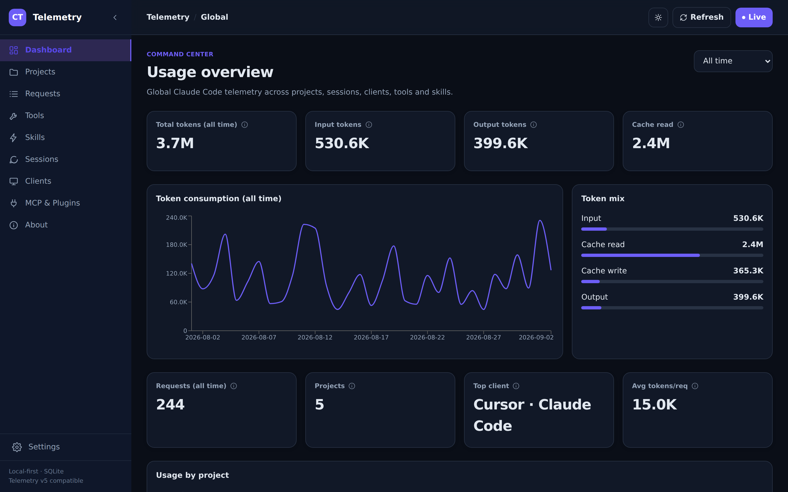
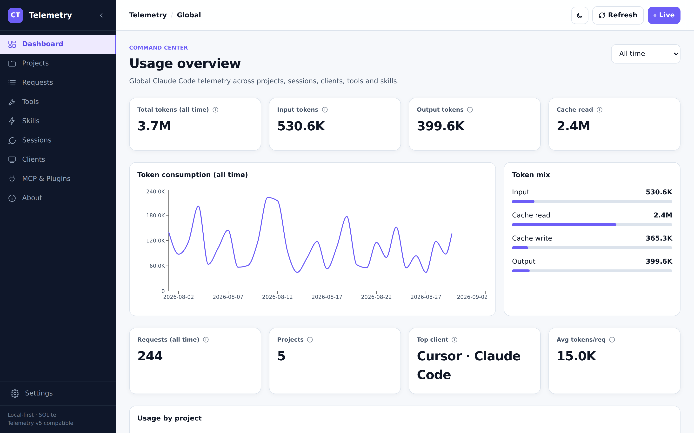
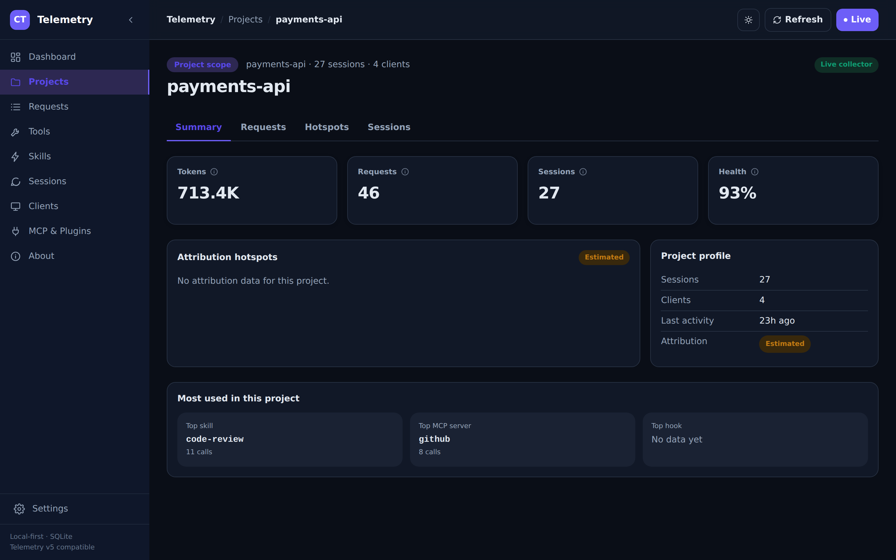

<div align="center">

# 📡⚡ Claude Telemetry Enterprise

### *The local-first token, tool, skill & MCP observability console for Claude Code*

<p>
  
  
  
  
</p>
<p>
  
  
  
  
  
</p>

Installs as a single **`tokentelemetry`** command · works with **Claude Code** sessions from the
terminal, **Cursor**, **VS Code**, **JetBrains**, and **Windsurf** — auto-classified, zero
configuration.

</div>

---

<p align="center">
  
</p>

## 📋 Table of Contents

1. [❓ Why](#why)
2. [✨ Features](#features)
3. [🚀 Quick Start (Install Locally)](#quick-start-install-locally)
4. [🔁 Running It Every Time](#running-it-every-time)
5. [🗄️ How Data Collection Works](#how-data-collection-works)
6. [🏗️ Architecture](#architecture)
7. [⚙️ Configuration](#configuration)
8. [🛠️ Manual / Development Setup](#manual--development-setup)
9. [📁 Project Structure](#project-structure)
10. [🧪 Testing](#testing)
11. [🎨 Design System](#design-system)
12. [🤝 Contributing](#contributing)
13. [📜 License](#license)

## ❓ Why

Claude Code doesn't ship a way to see, across every project you use it in: how many tokens
you're actually spending, which tools and skills drive that spend, which MCP servers and
hooks are active, and where the context is going. This fills that gap — entirely on your
own machine, against your own Claude Code session data, with no telemetry of its own sent
anywhere.

## ✨ Features

- **Exact vs. estimated, always labeled.** Token counts come straight from the Claude API.
  Per-file/tool attribution is a clearly-badged heuristic — see the in-app **About** page
  (`/about`) for exactly how it's computed.
- **Full prompt/response inspection.** Drill into any request and open the complete,
  untruncated prompt and response in its own page.
- **Dark / light mode**, with a persistent toggle and OS-preference detection.
- **All-time by default**, with a date-range filter — not capped at the last 30 days.
- **Per-project breakdowns** of the top skill, MCP server, and hook in use.
- **Tools, skills, MCP servers, clients, and sessions**, each with their own dedicated view.
- **No cost/pricing columns** in the primary UI — intentionally excluded, since billing
  depends on the plan in effect and isn't a reliable token-telemetry primitive.

<table>
<tr>
<td width="50%"></td>
<td width="50%"></td>
</tr>
</table>

<p align="center">
  
</p>

## 🚀 Quick Start (Install Locally)

`tokentelemetry` isn't published to the npm registry, so there's no bare `npx tokentelemetry`
to run from just anywhere yet. Instead, clone this repo and run the one-shot setup script —
it works the same way on **Windows, macOS, and Linux**:

```bash
git clone https://github.com/sarveshtalele/tokentelemetry.git
cd tokentelemetry
node cli/setup.js
```

That single command:
1. **Detects your system** — OS/arch, Node, Python, and whether `uv` is available.
2. **Builds and installs `tokentelemetry` globally** (`npm pack` + `npm install -g`), so it's
   a normal command on your `PATH` afterward — no repo checkout needed to run it again.
3. **Configures the app** — copies files to `~/.tokentelemetry`, sets up a Python env
   (preferring `uv`), and wires the Claude Code hooks into `~/.claude/settings.json`.
4. **Only then** hands you an interactive menu:
   ```
   What would you like to do?
     1) Start the dashboard
     2) Stop the dashboard
     3) Show status
     4) Uninstall (remove Claude Code hooks)
     5) Exit
   ```

Pick **1**, then open **http://127.0.0.1:5173**.

Requires Node.js 18+ and Python 3.9+ on `PATH` — or [`uv`](https://docs.astral.sh/uv/), which
is used automatically when present (faster env setup). `cli/setup.js` checks for these up
front and tells you what's missing rather than failing partway through.

**Picked up a new commit?** `git pull`, then run `node cli/setup.js` again from the repo —
it rebuilds and reinstalls the global command before showing the menu.

### After the first run

Once step 2 above has run at least once, `tokentelemetry` is on your `PATH` — you don't need
the repo checkout for day-to-day use, just the commands directly. None of these rebuild or
reinstall anything, they just do the one thing:

| Command | What it does |
|---|---|
| `tokentelemetry install` | Set up the app + Python env + Claude Code hooks (safe to re-run) |
| `tokentelemetry start` | Start the backend (`:8000`), telemetry daemon, and dashboard (`:5173`) |
| `tokentelemetry status` | Show install location, running processes, and health checks |
| `tokentelemetry stop` | Stop everything started by `start` |
| `tokentelemetry uninstall` | Remove the Claude Code hooks (leaves app files and the database in place) |
| `tokentelemetry uninstall --purge` | Remove the hooks **and** delete `~/.tokentelemetry` (app files + database) completely — this is the full, end-to-end teardown |

Prefer running from the repo checkout instead of relying on global `PATH`? `cli/setup.js`
has the same fast subcommands — `node cli/setup.js start`, `stop`, `status`, `delete`
(equivalent to `uninstall --purge`) — none of which rebuild or reinstall anything either.
Only bare `node cli/setup.js` (or `node cli/setup.js install`) does the full build.

Full details: [`cli/README.md`](cli/README.md).

## 🔁 Running It Every Time

`tokentelemetry start` doesn't survive a reboot by itself — it just launches three
background processes. Two ways to keep it running:

- **On demand:** run `tokentelemetry start` whenever you want it; `tokentelemetry stop` to
  shut it down. `tokentelemetry status` tells you what's currently running.
- **Automatically at login:**
  ```bash
  tokentelemetry autostart enable
  ```
  One command, cross-platform. It registers a **Task Scheduler task** (Windows), a
  **launchd LaunchAgent** (macOS), or a **systemd `--user` service** (Linux) that runs the
  backend, daemon, and dashboard at login — using absolute paths to `node` and this
  package's own install, not something that depends on `PATH` being visible to the OS
  scheduler. `tokentelemetry autostart disable` removes it; `tokentelemetry autostart
  status` (or plain `tokentelemetry status`) shows whether it's on. `tokentelemetry
  uninstall --purge` disables it automatically as part of the full teardown.

  Running from the repo checkout instead? `node cli/setup.js autostart enable` does the
  same thing (menu option 4 in the interactive setup).

<details>
<summary>What <code>autostart enable</code> actually sets up, per OS (for when you'd rather do it by hand, or it needs troubleshooting)</summary>

**Windows** — a Task Scheduler task named "Claude Token Telemetry", trigger "At log on",
action `node.exe "<path to tokentelemetry.js>" start`. Equivalent manual PowerShell:
```powershell
$Action  = New-ScheduledTaskAction -Execute "node.exe" -Argument '"<path>\tokentelemetry.js" start'
$Trigger = New-ScheduledTaskTrigger -AtLogOn
$Principal = New-ScheduledTaskPrincipal -UserId $env:USERNAME -LogonType Interactive -RunLevel Limited
Register-ScheduledTask -TaskName "Claude Token Telemetry" -Action $Action -Trigger $Trigger -Principal $Principal -Force
```
Undo: `Unregister-ScheduledTask -TaskName "Claude Token Telemetry" -Confirm:$false`.

**macOS** — a launchd agent at `~/Library/LaunchAgents/com.tokentelemetry.app.plist` with
`RunAtLoad`, loaded via `launchctl load -w`. Undo: `launchctl unload` that file, then delete it.

**Linux** — a systemd user unit at `~/.config/systemd/user/tokentelemetry.service`
(`WantedBy=default.target`), enabled via `systemctl --user enable --now`. Undo:
`systemctl --user disable --now tokentelemetry.service`. Some minimal/headless setups don't
run a user systemd instance (`Failed to connect to bus`) — if so, `enable` will report that
clearly rather than pretending to succeed; the unit file above still gets written and can be
picked up manually once a user systemd session is available.

</details>

## 🗄️ How Data Collection Works

Data capture does **not** depend on `tokentelemetry start` being on:

1. `install` wires 5 hooks (`SessionStart`, `UserPromptSubmit`, `PreToolUse`, `PostToolUse`,
   `Stop`) into Claude Code's own `settings.json`. Claude Code invokes these directly, so raw
   tool-call/skill events land in the SQLite DB the moment they happen — dashboard running or
   not.
2. Per-request token usage (and full prompt/response text) comes from **reconcile**, which
   parses Claude Code's session transcripts. This runs on a timer once the daemon is started
   (`start`, or the autostart task above), and it's idempotent — it tracks each transcript
   file's mtime/size, so turning the daemon off for a while and back on backfills everything
   it missed, nothing is lost.

## 🏗️ Architecture

```
Claude Code
   │  hooks (SessionStart, UserPromptSubmit, PreToolUse, PostToolUse, Stop)
   ▼
hooks/claude-telemetry-hook.py ──► SQLite (~/.claude/telemetry/telemetry.db)
                                          ▲
telemetry/daemon.py  (polls, every 5s)   │
   └─ telemetry/reconcile.py  ───────────┘  parses ~/.claude/projects/**/*.jsonl
                                          │  (exact token usage, tool calls, skills)
                                          ▼
                          backend/  FastAPI  (/api/v1, /ws/live)
                                          │
                                          ▼
                          frontend/  React + Vite + TypeScript + Tailwind + Recharts
```

Two independent capture paths feed the same database: the **hooks** give you live events the
instant they happen, and **reconcile** backfills exact token usage and full transcripts from
Claude Code's own session files — so nothing depends on the dashboard being open, and nothing
is lost if the daemon was off for a while.

## ⚙️ Configuration

All optional; sensible defaults apply if unset.

| Variable | Default | Purpose |
|---|---|---|
| `CLAUDE_TELEMETRY_DB` | `~/.claude/telemetry/telemetry.db` | SQLite database path |
| `CLAUDE_CONFIG_DIR` | `~/.claude` | Claude Code config directory (where `settings.json` and `projects/` live) |
| `TOKENTELEMETRY_HOME` | `~/.tokentelemetry` | Where the CLI installs the app |
| `CLAUDE_TELEMETRY_INTERVAL` | `5` | Daemon poll interval, in seconds |
| `CLAUDE_TELEMETRY_FORCE_RECONCILE` | unset | Set to `1`/`true` to force a full re-parse of every transcript on the next reconcile |

## 🛠️ Manual / Development Setup

If you're working on the app itself rather than just running it, skip the CLI and run the
pieces directly:

```bash
cd backend && python run.py                # API on :8000
cd frontend && npm install && npm run dev   # React UI on :5173
```

`start_dashboard.bat` (Windows) does both, plus a reconcile pass. There is no separate static
HTML fallback — the React app in `frontend/` is the one real frontend, in dev mode here and
as the built bundle the CLI serves in production. Opening it via `file://` will not work — the
browser blocks the cross-origin API fetch; always serve it (`npm run dev`, or the CLI).

### Pages
- `/` — global command center · `/projects` — project inventory · `/projects/:id` — project
  workspace (with per-project skill/MCP/hook usage) · `/requests` and `/requests/:id` — request
  explorer and full prompt/response view · `/sessions`, `/tools`, `/skills`, `/clients`,
  `/mcp-plugins` — telemetry breakdowns · `/settings` — collector/data semantics ·
  `/about` — what "estimated attribution" means and what this tool tracks

## 📁 Project Structure

```
.
├── backend/           FastAPI service — REST (/api/v1) + WebSocket (/ws/live) over SQLite
│   └── app/
│       ├── api/routes/    One module per resource (usage, projects, tools, skills, mcp, …)
│       └── db/             connection.py (its own connect() wrapper) + schema.py
│                             (re-exports telemetry/db.py's SCHEMA/migrations — see below)
├── frontend/           React + Vite + TypeScript + Tailwind + Recharts dashboard
│   └── src/
│       ├── pages/          One component per route
│       ├── components/     Layout, charts, data tables, shared UI
│       ├── api/             Typed fetch wrappers per resource
│       └── hooks/           useApi, useLiveData (WebSocket), useTheme (dark/light)
├── telemetry/          The canonical collector, reconcile, and SQLite schema/migrations —
│                        backend/ imports this directly (sys.path bootstrap in
│                        backend/app/main.py) instead of keeping a second copy
├── hooks/               claude-telemetry-hook.py — what Claude Code actually invokes
├── cli/                 npx-style installer (`tokentelemetry` command) — see cli/README.md
├── tests/               Backend API + reconcile pytest suite
├── docs/                Design/implementation notes, README screenshots
├── .github/              Issue/PR templates
├── CONTRIBUTING.md
├── LICENSE               MIT
└── DESIGN.md            Design tokens + rationale (Google Labs DESIGN.md format)
```

## 🧪 Testing

```bash
uv venv .venv && uv pip install -p .venv -r backend/requirements-dev.txt   # or plain venv/pip
.venv/bin/python -m pytest tests/test_backend_api.py tests/test_reconcile.py
```

`tests/test_dashboard.py` is a Playwright suite for the legacy Streamlit prototype
(`app.py`) and requires `pytest-playwright` plus a running Streamlit instance — it's not part
of the primary React app's test path.

## 🎨 Design System

`DESIGN.md` follows the Google Labs DESIGN.md format: YAML design tokens plus ordered
rationale sections, including light/dark theming rules and the exact-vs-estimated labeling
convention. Source specification: https://github.com/google-labs-code/design.md

## 🤝 Contributing

See [`CONTRIBUTING.md`](CONTRIBUTING.md) — issue/PR templates live under
[`.github/`](.github). Short version: run the tests and `npm run build`, keep diffs focused,
and there's exactly one schema/collector/reconcile implementation (`telemetry/`) — `backend/`
imports it directly rather than keeping its own copy.

## 📜 License

[MIT](LICENSE) — see the [`LICENSE`](LICENSE) file for the full text.
