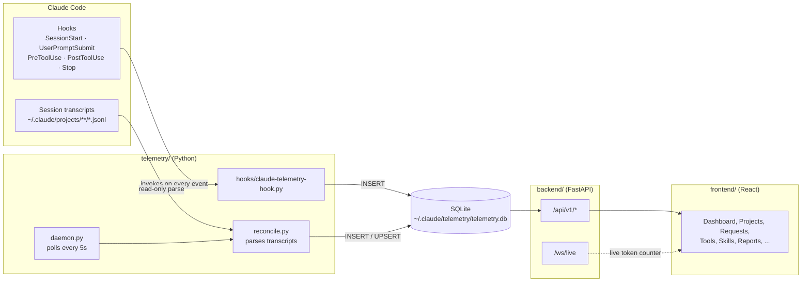
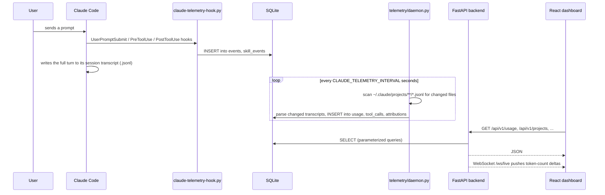
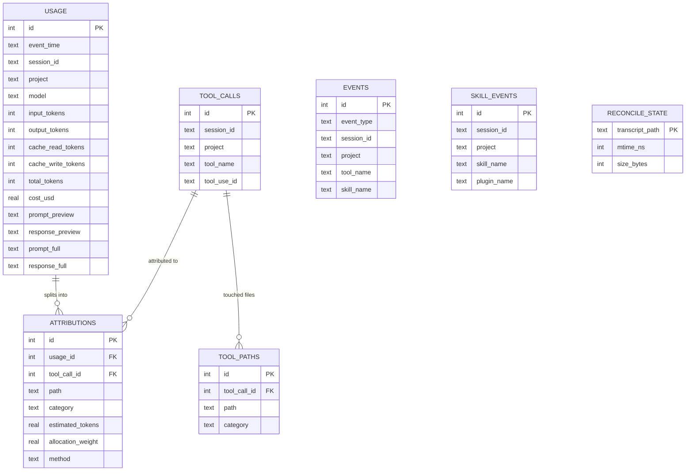

# Architecture

This document explains how Claude Telemetry Enterprise is put together: the
components, how data flows from a Claude Code session into the dashboard,
the database schema, and the reasoning behind the main design decisions.
For a page-by-page tour of the product itself, see the [User Guide](USER_GUIDE.md).

## System overview

The system has four moving parts, all running on the user's own machine:

Two capture paths write to the same database, independently:

1. **Hooks** (`hooks/claude-telemetry-hook.py`) run synchronously whenever
   Claude Code fires one of the five wired events. They write raw tool-call
   and skill-activation rows to SQLite immediately — this works even if
   `tokentelemetry start` has never been run, because Claude Code invokes
   the hook script directly.
2. **Reconcile** (`telemetry/reconcile.py`), driven by `telemetry/daemon.py`
   on a timer, parses Claude Code's own session transcript files
   (`~/.claude/projects/**/*.jsonl`). This is the only source of *exact*
   per-request token usage — the Claude API reports usage per request, not
   per tool call, and the hooks never see the model's raw response — so
   reconcile is what backfills the `usage` table, full prompt/response
   text, and per-file/tool attribution.

Reconcile is idempotent: it tracks each transcript file's `(mtime, size)`
in `reconcile_state` and only re-parses files that changed, so turning the
daemon off for a while and back on catches up automatically with nothing
duplicated or lost.

## Request lifecycle

What happens between a user sending a prompt and a row showing up on the
dashboard:

## Database schema

All tables live in one SQLite database (WAL mode), defined once in
`telemetry/db.py` and shared by the daemon and the backend (see
[Single source of schema](#single-source-of-schema-and-collector-logic)
below).

- **`usage`** is the source of truth for token counts — one row per
  Claude API response, always exact.
- **`events`** holds raw, live hook firings (fast, but not exact usage).
- **`tool_calls`** / **`tool_paths`** come from reconcile parsing tool-use
  blocks in transcripts, including which file paths each call touched.
- **`skill_events`** records skill activations, with `plugin_name` split
  out when a skill identifier is namespaced as `plugin:skill`.
- **`attributions`** is the *estimated* layer: each `usage` row's exact
  token count is divided across the tool calls active near it in the
  transcript, then split again across the file paths those tools touched.
  A slice that can't be matched to a nearby tool call is bucketed as
  `[unattributed]` rather than dropped — see the in-app **About** page for
  the full explanation of exact vs. estimated.
- **`reconcile_state`** is reconcile's own bookkeeping (not exposed in the
  UI) — one row per transcript file, used to skip unchanged files.

## Component responsibilities

| Component | Responsibility | Depends on |
|---|---|---|
| `hooks/claude-telemetry-hook.py` | Entry point Claude Code invokes for each hook event | `telemetry.collector` |
| `telemetry/collector.py` | Parses a single hook payload, writes `events`/`skill_events` | `telemetry.db` |
| `telemetry/reconcile.py` | Parses session transcripts, writes `usage`/`tool_calls`/`attributions` | `telemetry.db` |
| `telemetry/daemon.py` | Runs `reconcile()` on a poll loop | `telemetry.reconcile` |
| `telemetry/db.py` | Canonical schema (`SCHEMA`) + migrations (`migrate()`) + `connect()` | stdlib `sqlite3` |
| `backend/app/db/schema.py` | Re-exports `telemetry.db`'s schema/migrations | `telemetry.db` |
| `backend/app/api/routes/*.py` | One FastAPI router per resource, read-only except `/settings/reconcile` | `backend/app/db/connection.py` |
| `frontend/src/pages/*.tsx` | One React page per route | `frontend/src/api/*.ts` |
| `cli/` | Cross-platform installer, process manager, and OS autostart registration | Node.js stdlib + `child_process` |

### Single source of schema and collector logic

Earlier revisions of this project had three independently copied
implementations of the schema, collector, and reconcile logic — one under
`telemetry/`, one under `backend/app/services/`, and inline migrations in
`backend/app/db/schema.py`. They drifted from each other more than once
(most notably, a schema migration existed in one copy but not the others).
The current structure makes `telemetry/` the single canonical
implementation: `backend/app/main.py` adds the repo root to `sys.path` at
startup so `backend/` can `import telemetry` directly, and
`backend/app/db/schema.py` is now a two-line re-export. There is exactly
one place that defines the schema and exactly one place that parses a
transcript.

## Why two capture paths instead of one

An earlier, simpler design considered relying on hooks alone. That doesn't
work for two reasons: `PostToolUse` fires before the model's response
finishes streaming, so hooks never see the actual token usage for that
turn; and a hook only fires while Claude Code is running, so anything that
happened before `tokentelemetry install` was run would be invisible.
Reconcile solves both — it reads the durable transcript files Claude Code
already writes for its own purposes, so it can backfill historical data and
capture exact usage that hooks structurally cannot see. Keeping the hooks
around as well (rather than reconcile-only) is what makes `tool_calls`
and `skill_events` show up **immediately**, without waiting for the next
poll — useful for the live event feed and the `/ws/live` counter.

## Frontend structure

The React app (`frontend/src/`) is organized by concern, not by page:

- **`pages/`** — one component per route (`GlobalDashboard`, `ProjectDetail`,
  `Requests`, `Reports`, `About`, ...), each responsible for its own data
  fetching via `useApi()` and layout.
- **`components/`** — shared building blocks: `Layout/` (sidebar, top bar,
  the `Outlet`-based `AppLayout`), `charts/` (Recharts wrappers with a
  shared `chartTheme.ts`), `data/` (`MetricCard`, `StatRow`), `ui/`
  (buttons, badges, tooltips, icons), `filters/` (`DateRangeFilter`).
- **`api/`** — one typed fetch wrapper module per backend resource,
  all going through `api/client.ts`'s `fetchApi()`, which prefixes
  `/api/v1` and throws on a non-2xx response.
- **`hooks/`** — `useApi` (fetch + loading/error state), `useLiveData`
  (subscribes to `/ws/live`), `useTheme` (dark/light mode, persisted to
  `localStorage` plus `prefers-color-scheme` as the default).

There is no separate static-HTML fallback UI — the React app is the one
real frontend, served by Vite in development and by the CLI's own minimal
static file server (`cli/src/static-server.js`) in production, which also
reverse-proxies `/api` and `/ws` to the FastAPI backend so the built
frontend and the API can share an origin.

## CLI / installer

`cli/` is a self-contained npm package (see [`cli/README.md`](../cli/README.md)
for the full command reference). At a high level:

- `install.js` copies the vendored `backend/`, `telemetry/`, and `hooks/`
  sources plus the built `frontend/dist` into `~/.tokentelemetry`, creates
  a Python virtualenv (preferring `uv`), and merges the five hook entries
  into `~/.claude/settings.json`.
- `run.js` spawns the backend (`uvicorn`), the daemon (`python -m
  telemetry.daemon`), and the static file server as detached background
  processes, tracking their PIDs in `~/.tokentelemetry/run.json` so
  `stop`/`status` can find them again later.
- `autostart.js` registers an OS-native autostart entry (Windows Task
  Scheduler, macOS launchd, or a Linux systemd `--user` service) that runs
  `node <path to tokentelemetry.js> start` at login, using absolute paths
  throughout since OS schedulers typically don't see a login shell's
  `PATH`.
